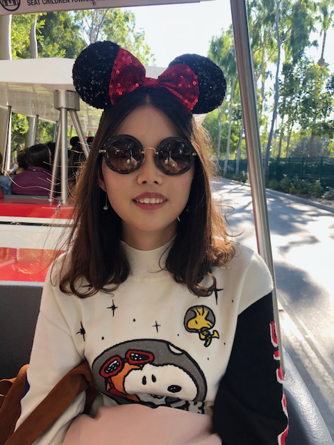

Hello, I am a research scientist at AMD GenAI Team. I am interested in the deep learning and computer vision. In particular, I work on efficient learning, vision-language models, and multi-task learning.

I earned my Ph.D. degree from Computer Science at Boston University starting from 2019 Spring, supervised by  <a href="http://ai.bu.edu/ksaenko.html">Prof. Kate Saenko</a>.
During my Ph.D. study, I have been fortunate to collaborate with top research labs as an intern, including Meta AI, Google Cloud and IBM Research. During 2022, I was part of Meta AI's team where I had the opportunity to collaborate with <a href="https://xidexia.github.io/">Xide Xia</a>, <a href="https://pzzhang.github.io/pzzhang/">Pengchuan Zhang</a> and <a href="https://research.facebook.com/people/zhang-peizhao/">Peizhao Zhang</a>.  In 2021 Summer, I joined Google Cloud where I worked closely with  <a href="https://scholar.google.com/citations?user=Vu3vH2sAAAAJ&hl=en">Clayton Mellina</a>, <a href="https://scholar.google.com/citations?user=ZpF26loAAAAJ&hl=en">Xiao Bian</a> and <a href="https://scholar.google.com/citations?user=VxpypngAAAAJ&hl=en">Kihyuk Sohn</a>.  In 2019 and 2020 Summer, I worked alongside <a href="http://rogerioferis.com/">Rogerio Feris</a> and <a href="https://rpand002.github.io/ ">Rameswar Panda</a> at IBM Research.

Previously, I received my M.S. in ECE from University of Michigan, Ann Arbor and received B.ENG. in Communication Engineering from Beijing University of Posts and Telecommunications.

---

<h4>contact</h4>

Ximeng Sun 

Email: sxm2357 [AT] gmail [dot] com  

